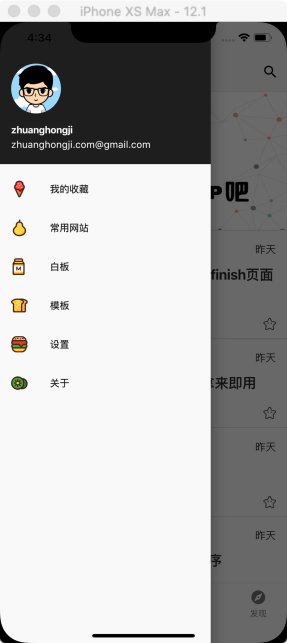
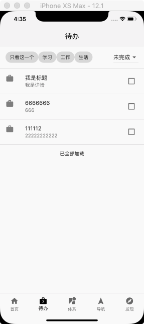
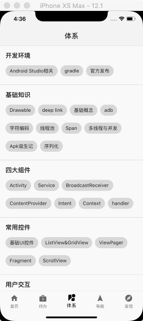
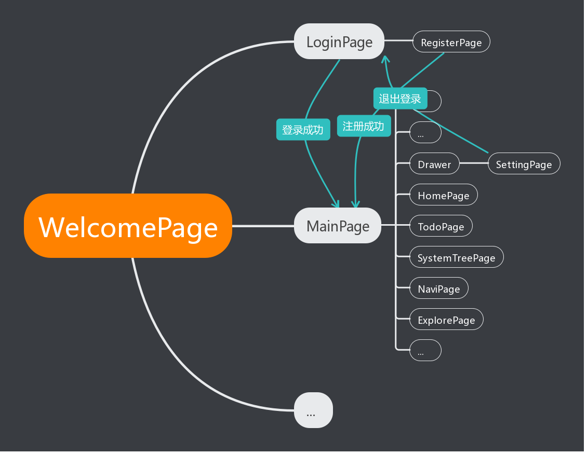

# wan-android-flutter

WAN ANDROID 客户端 - Flutter 实现版


## 概述

[WAN ANDROID](http://www.wanandroid.com/) ，一个优质的 Android 站点。

WAN ANDROID 站点汇总了 Android 相关的项目、知识体系、公众号文章和工具：

* 在站内你可以及时看到业界最新的博客文章、发现最新的项目
* 同时你也可以利用站点提供的一些工具（比如正则、二维码生成..）来提高开发效率。

本仓库是一个基于 WAN ANDROID 开放 API 开发的 Flutter 项目，相关的项目还有：

* [wan-android-kt](https://github.com/zhuanghongji/wan-android-kt)
* [wan-android-rn](https://github.com/zhuanghongji/wan-android-rn)
* wan-android-flutter


## 截图

| 菜单 | 首页 | 待办 | 体系
| - | - | - | -
|  |  |  |  |

[点击查看更多截图](./screenshots/)


## 代码结构

```
├ android
├ ios          
├ lib         
   ├ api       
      ├ datas                    接口返回结果实体类的存放目录（一个类一个文件）
         ├ article.dart
         ├ articles.dart
         └ ...
      ├ api_constant.dart        接口相关常量
      ├ api_service.dart         封装了 WAN ANDROID OPEN API 的所有请求
      └ base_resp.dart           包装接口返回结果的泛型类文件
   ├ assets                      资源文件和对应类文件的存放目录
      ├ images                   所有图片文件的存放目录
      ├ images.dart              通过常量来索引所有图片资源
      └ ...
   ├ base
      ├ base_page.dart           所有页面部件的基类文件
      └ ...
   ├ http
      ├ interceptors             自定义网络拦截器的存放目录
      └ http_managers.dart       在 Dio 上封装一层的网络请求类 
   ├ common                      通用类文件存放目录
   ├ manager                     管理类文件存放目录
      ├ sp_manager.dart          封装了 SharedPreferenced 相关 API 的类
      └ ...
   ├ pages                       所有页面类文件的存放目录（一个页面一个目录，目录下对应一个 xxx_page.dart 文件）
      ├ about                    关于页面
         ├ ...                   （当前页面独立出来的部件，仅该页面使用）
         └ about_page.dart  
      ├ board                    白板页面（非业务相关，仅用于快速编写和预览组件）
         └ board_page.dart 
      ├ main                     主页面目录
         ├ home                  首页
         ├ todo                  待办事项
         ├ system                体系
         ├ navi                  导航
         ├ explore               发现
         ├ main_bottom_bar.dart  主页面底部栏
         ├ main_drawer.dart      主页面侧滑菜单
         └ main_page.dart        主页面
      ├ template                 页面模板（你可以复制该目录再重命名，以快速开发页面）
         └ template_page.dart    
      └ ...
   ├ router
      └ w_router.dart            路由管理类（处理当前应用所有页面的跳转）
   ├ utils                       工具类文件的存放目录
   ├ widget                      通用部件的存放目录（如果仅是某一个页面使用的话，请放在该页面的目录下）
   └ ...
├ screenshots      
├ test         
└ pubspec.yaml         
```


## 路由示意图



> `WelomePage` - 启动页面，是应用入口。


## 第三方依赖

* [dio](https://pub.dartlang.org/packages/dio)
* [event_bus](https://pub.dartlang.org/packages/event_bus)
* [shared_preferences](https://pub.dartlang.org/packages/shared_preferences)
* [lutter_swiper](https://pub.dartlang.org/packages/flutter_swiper)
* [flutter_slidable](https://pub.dartlang.org/packages/flutter_slidable)
* [flutter_webview_plugin](https://pub.dartlang.org/packages/flutter_webview_plugin)
* ...


## 待完善

* [ ] 支持主题切换
* [ ] 支持多用户使用（切换账号）
* [ ] 支持新增和修改待办事项
* [ ] 发布 V1.0.0 版本
* [ ] 封装 DialogManager 并优化一些交互上的逻辑
* [ ] ...


## License

```
Copyright (C) 2019 zhuanghongji

Licensed under the Apache License, Version 2.0 (the "License");
you may not use this file except in compliance with the License.
You may obtain a copy of the License at

   http://www.apache.org/licenses/LICENSE-2.0

Unless required by applicable law or agreed to in writing, software
distributed under the License is distributed on an "AS IS" BASIS,
WITHOUT WARRANTIES OR CONDITIONS OF ANY KIND, either express or implied.
See the License for the specific language governing permissions and
limitations under the License.
```
